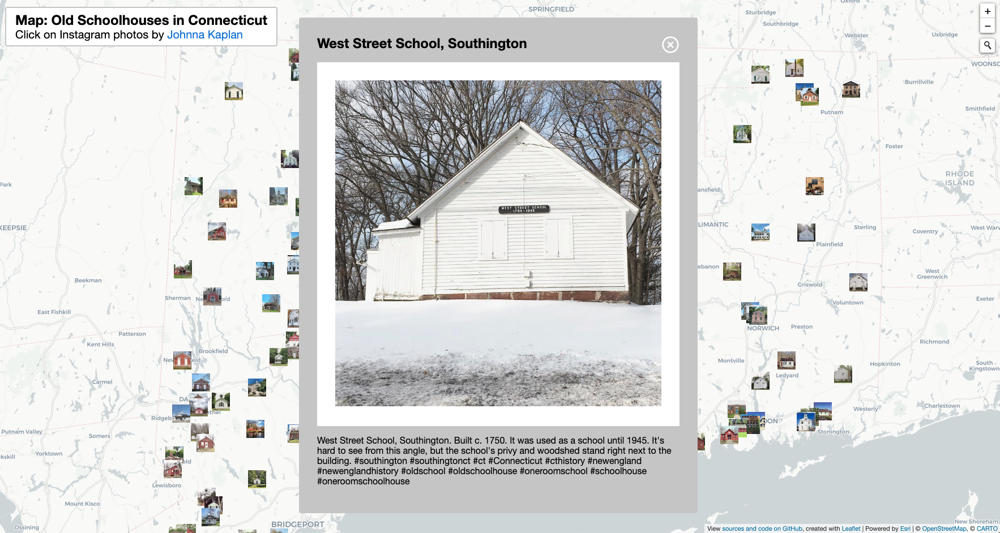

# otl-oldschoolct
Interactive map of OldSchoolCT Instagram photos by Johnna Kaplan. Jupyter Notebook downloads and processes photos from Instagram.

## View online at https://ontheline.github.io/otl-oldschoolct/index-caption.html

## Embedded in On The Line book http://ontheline.trincoll.edu

## Credits
- All photos of one-room Connecticut schoolhouses copyrighted by Johnna Kaplan, and publicly viewable on her Instagram account: https://www.instagram.com/oldschoolct/
- Coding and map design by [Ilya Ilyankou](https://github.com/ilyankou) and Jack Dougherty.
- Python tool to download Instagram images and metadata https://instaloader.github.io/
- Many thanks to Elizabeth Rose for researching school site addresses to improve geographic precision.

## Jupyter processing
See the notebook for processing steps (including download). All photos are saved in `photos/` folder, and all metadata is saved in the `catalog.csv` file. The thumbnails (smaller images that are shown on the map, in other words icons) are created with Wand library (http://docs.wand-py.org/en/0.5.7/) and are saved in `photos/thumbnails/`.

1. `Title` column is generated from the caption. It is assumed that a first sentence of the caption contains the school name and/or location (eg `Old Center School, Burlington`).
1. Based on that assumption, `Geocoded` column contains geocoded coordinates of what Google API thinks is an appropriate location for that school name and location.
1. `Latitude` and `Longitude` columns are derived from the `Geocoded` column.

## Catalog-refined
- Created duplicate of `catalog.csv` called `catalog-refined.csv` to research school site addresses, and manually improve precision of geographic coordinate data without overwriting python download. Map pulls image data from the latitude and longitude columns of `catalog-refined.csv`.
- Keep all rows intact to match with original. Omit selected rows (e.g. secondary photos of school interiors, historical signs) from map display by removing data from Lat and Long columns.

## TODO
- Need help from photographer or others to locate 9 addresses for 9 remaining photos [in this Google Sheet](https://docs.google.com/spreadsheets/d/1JouNnQTA6FGgCJbVaVoIBKxddhGuO999ecHIMOYfi-Y/edit#gid=1842420214)
- For future photos, asked photographer to add street address or intersection to Instagram captions to allow easier placement on map.
