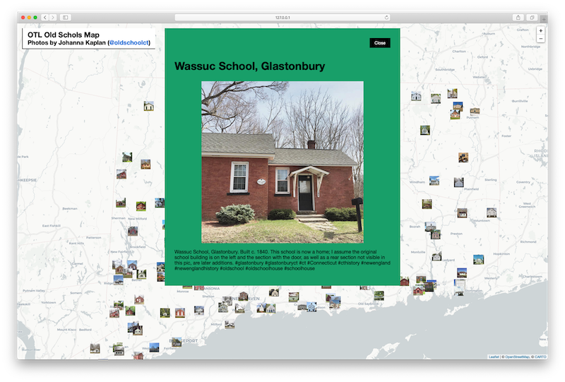

# otl-oldschoolct
DEMO interactive map of OldSchoolCT photos by Johnna Kaplan

All photos of one-room Connecticut schoolhouses copyrighted by Johnna Kaplan, and publicly viewable on her Instagram
https://www.instagram.com/oldschoolct/

This Python tool downloads Instagram images and metadata
https://instaloader.github.io/

## Jupyter processing

See the notebook for processing steps (including download). All photos are saved in `photos/` folder, and all metadata is saved in the `catalog.csv` file. The thumbnails (smaller images that are shown on the map, in other words icons) are created with Wand library (http://docs.wand-py.org/en/0.5.7/) and are saved in `photos/thumbnails/`.

1. `Title` column is generated from the caption. It is assumed that a first sentence of the caption contains the school name and/or location (eg `Old Center School, Burlington`).
1. Based on that assumption, `Geocoded` column contains geocoded coordinates of what Google API thinks is an appropriate location for that school name and location.
1. `Latitude` and `Longitude` columns are derived from the `Geocoded` column.

## Catalog-refined

- Created duplicate of `catalog.csv` called `catalog-refined.csv` to manually revise processed data without overwriting python download.
- Keep all rows intact to match with original. Omit rows from map display by removing Lat and Long

## TODO
- Note that photo placement on map is APPROXIMATE based on town name, not address
- Continue to refine school geocoding. If  photographer has original photos with EXIF data, we can automate this.
